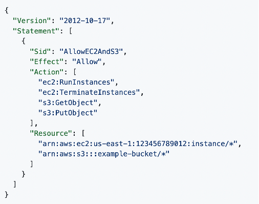
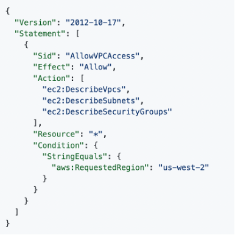
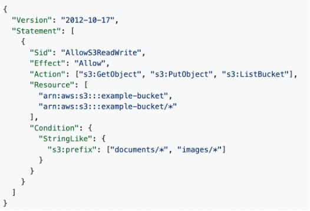
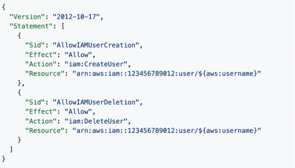
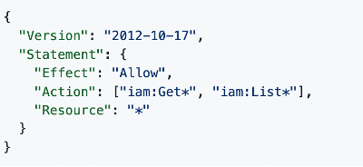
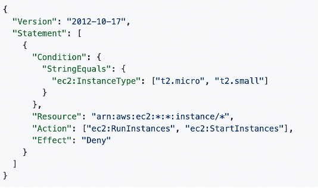
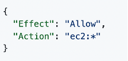

# CAPSTONE-PROJECT-SE1 
**Killian GRAINDORGE, Baptiste BILLY-GAGNAIRE, Thibaud DANDOY**
#

**VPC**

* let's start by creating a VPC for the project with 10.0.0.4/16 ipv4 CDR     
#
**Network**
* After we create a public subnet to link our vpc
  

  
* And allow ipv4 auto-assign ip to find it later on internet.
  
 
  
* Now we create an internet gateway to connect from internet to our vpc.
  

  
* We create a routing table and edit the rules that allow incoming traffic to our vpc from the internet.
  
 
  
#
**Security & Cloud9**
* We create a security group, to block all incoming traffic and allow it on only three ports for http, https and ssh protocols.
  

  
* We create an ec2 instance from cloud9, after we link it to the vpc and the public network. We chosed the ssh secure shell connexion
  

  
* With cloud9 console and ssh connexion we install apache2, php, mariadb, and download the website of the subject on /var/www/html and change the owner of it to allow execution ot the php.
  

  
* So now the ec2 instance is created and we need to connect it to our security group, we modified the security group setting.
  

  
#
**Website view**
  

#
**Database**
* Now we create a Maria DB instance and setup the password.
  

  
* We need to establish a link with our EC2 instance. And we also link the databse to our vpc.
  

  
* We create automatically a private subnet for our DB and we give the access to our VPC security group.
  

  
* An AWS view where we can see that three self-managed private subnets were created in the process.
  

  
* We import the data from the SQL file that you give us on our DB using cloud 9 shell of our ec2 instance.
  

  
* We create three parameters to save username, password, endpoint and table name in the parameter store of AWS System Manager.
  

  
* We create an endpoint to link the website code to the DB.
  

  
#
**IAM**
* We create an IAM role to allow our PHP website on our EC2 instance to access on our webserver.
  

  
* We attached the role to our ec2 instance.
  

  
#
**List of countries and the data**
  

# IAM policies
**Question 1:**
  

  
EC2 instances
* “ec2:RunInstances”: allows the user to launch new EC2 instances.
* “ec2:TerminateInstances”: allows the user to terminate EC2 instances.
* “arn:aws:ec2:us-east-1:123456789012:instance/*: allows all actions on all EC2 instances in the specified region (us-east-1) for the account ID 123456789012.
  

S3 instances
* “s3:GetObject”: allows the user to retrieve S3 objects
* “s3:PutObject”: allows the user to upload S3 objects
* “arn:aws:s3:::example-bucket/*”: allows actions on all objects within the example-bucket S3 bucket. 
  

**Question 2:**
  

  
* “aws:RequestRegion”: “us-west-2” : allows access to VPC-related information only if the requested AWS region is set to “us-west-2”.
  

**Question 3:**
  

  
Actions allowed on “example-bucket”: 
* “s3:GetObject”: allows the user to retrieve objects from the “example-bucket”. 
* “s3:PutObject”: allows the user to upload objects into the “example-bucket”. 
* “s3:ListBucket”: allows the user to list objects within the “example-bucket”. 
  

Specified prefixes in the condition: 
* “documents/*”: allows access to objects in the “bucket-example” that have the “document” prefix. 
* “images/*”: allows access to objects in the bucket-example” that have the “images” prefix. 
  

**Question 4:**
  

  

Allowed actions: 
* “iam:CreateUser”: allows the user to create IAM users. 
* “iam:DeleteUser”: allows the user to delete IAM users. 
  

Resource ARNs: 
* Follows the following template “arn:aws:iam::123456789012:user/${aws:username}” 
* “${aws:username} is dynamically replaced by the username of the user currently connected. Ensures the users will only perform their allowed actions on their own IAM user resource. 
  

**Question 5:**
  

  
* This policy grant access to all actions that start with Get “iam:Get*” and all actions that start with List “iam:List*”. 
* It does not allow to create anything. For that we would need to add “iam:Create*” to the actions allowed. 
  

“iam:Get*” allows:
* “Iam:GetGroup”: allows to retrieve a list of IAM users that are in the specified IAM group. 
* “iam:GetRole”: allows to retrieve information about the specified role (role’s path, GUID, ARN, role’s trust policy). 
*“iam:GetUser”: allows to retrieve information about the specified IAM user (user’s creation date, path, unique ID and ARN).  
  

**Question 6:**
  

  
The actions “ec2:RunInstances” and “ec2:StartInstances” are denied to the user this policy is assigned to. However all actions not lister in the actions will be allowed to the user.  
  
Say that the policy included an additional statement object, like this example:
  

  
The “allow” statement takes precedence over the “deny” effect. Therefore, the user will have access to all actions on ec2 instances and the actions defined before will not be taken into account. You would be able to terminate an instance as you would have all actions allowed on ec2 instances. 
